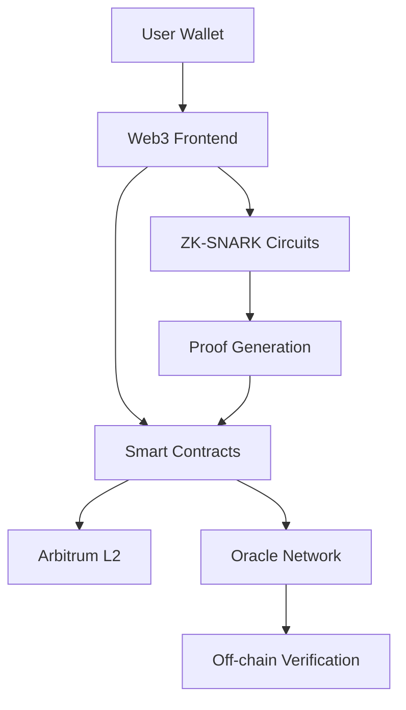

# 🚀 Shielded CSV Developer Journey

## 📋 Table of Contents

- [Introduction](#introduction)
- [System Architecture](#system-architecture)
- [Development Environment Setup](#development-environment-setup)
- [Smart Contract Development](#smart-contract-development)
- [ZK-SNARK Circuit Development](#zk-snark-circuit-development)
- [Frontend Development](#frontend-development)
- [Testing and Deployment](#testing-and-deployment)
- [Security Checks](#security-checks)
- [Performance Optimization](#performance-optimization)
- [Troubleshooting](#troubleshooting)

---

## 🎯 Introduction

Shielded CSV is a privacy-focused token transfer system running on Arbitrum. This documentation is prepared for developers to understand the system and contribute to it.

### 🎪 System Features

- **Privacy**: ZK-SNARK based proof system
- **Scalability**: Arbitrum L2 advantages
- **Security**: Nullifier-based double-spend protection
- **User-Friendly**: Web3 wallet integration

---

## 🏗️ System Architecture

### 📊 General Architecture



### 🔧 Core Components

#### 1. **Core Smart Contracts**

- `ShieldedCSV.sol` - Main protocol contract
- `CSV_ERC20Vault.sol` - ERC-20 token vault
- `CSV_NativeVault.sol` - Native ETH vault
- `VerifierOracle.sol` - ZK proof verification system

#### 2. **ZK-SNARK Circuits**

- `withdraw-full.circom` - Full withdrawal circuit
- `withdraw-minimal.circom` - Minimal withdrawal circuit
- `withdraw-real.circom` - Production circuit

#### 3. **Frontend Components**

- React/TypeScript web application
- MetaMask integration
- ZK proof generation library

---

## 🛠️ Development Environment Setup

### 📦 Requirements

```bash
# Node.js (v18+)
node --version

# Yarn or npm
npm --version

# Hardhat
npm install -g hardhat

# Circom (for ZK-SNARK circuits)
npm install -g circom
```

### 🚀 Setup Steps

```bash
# 1. Clone repository
git clone <repository-url>
cd shielded-csv-arbitrum

# 2. Install dependencies
npm install

# 3. Compile circuits
cd circuits
npm install
npm run build

# 4. Set environment variables
cp .env.example .env
# Edit .env file
```

### 🔑 Environment Variables

```env
# Arbitrum Sepolia Testnet
ARBITRUM_SEPOLIA_RPC_URL=https://sepolia-rollup.arbitrum.io/rpc
PRIVATE_KEY=your_private_key_here

# Contract Addresses (will be updated after deployment)
SHIELDED_CSV_ADDRESS=
ERC20_VAULT_ADDRESS=
NATIVE_VAULT_ADDRESS=
VERIFIER_ORACLE_ADDRESS=
```

---

## 📝 Smart Contract Development

### 🏛️ Contract Architecture

#### ShieldedCSV.sol - Main Protocol

```solidity
contract ShieldedCSV {
    // Nullifier management
    mapping(bytes32 => bool) public spentNullifiers;
    uint256 public nullifierCount;

    // Security controls
    mapping(address => bool) public authorizedVaults;
    bool public paused;

    // Rate limiting
    mapping(address => uint256) public lastNullifierTime;
    uint256 public constant MIN_NULLIFIER_INTERVAL = 1;
}
```

#### CSV_ERC20Vault.sol - Token Vault

```solidity
contract CSV_ERC20Vault {
    IERC20 public immutable token;
    ShieldedCSV public immutable csvCore;

    // Deposit function
    function deposit(uint256 amount, bytes32 nullifier) external {
        token.transferFrom(msg.sender, address(this), amount);
        csvCore.markNullifierSpent(nullifier);
    }

    // Withdraw function
    function withdraw(uint256 amount, bytes calldata proof) external {
        require(verifierOracle.verifyWithdrawalProof(msg.sender, amount, proof));
        token.transfer(msg.sender, amount);
    }
}
```

### 🔄 Development Workflow

#### 1. **Contract Changes**

```bash
# Edit contract
vim contracts/ShieldedCSV.sol

# Compile
npx hardhat compile

# Test
npx hardhat test
```

#### 2. **Gas Optimization**

```solidity
// ❌ Bad - Separate storage for each transaction
mapping(address => uint256) public userBalance;

// ✅ Good - Batch operations
function batchMarkNullifiers(bytes32[] calldata nullifiers) external {
    for(uint i; i < nullifiers.length; i++) {
        spentNullifiers[nullifiers[i]] = true;
    }
}
```

#### 3. **Security Checks**

```solidity
// Reentrancy protection
modifier nonReentrant() {
    require(!_entered[msg.sender], "Reentrant call");
    _entered[msg.sender] = true;
    _;
    _entered[msg.sender] = false;
}

// Access control
modifier onlyAuthorizedVault() {
    require(authorizedVaults[msg.sender], "Unauthorized vault");
    _;
}
```

---

## 🔐 ZK-SNARK Circuit Development

### 🎯 Circuit Architecture

#### withdraw-full.circom

```circom
template WithdrawFull() {
    // Private inputs
    signal input secret;
    signal input nonce;
    signal input amount;
    signal input merkleRoot;

    // Public outputs
    signal output nullifierHash;
    signal output commitmentHash;
    signal output amountOut;
    signal output merkleRootOut;

    // Nullifier generation
    component nullifierHasher = Poseidon(2);
    nullifierHasher.inputs[0] <== secret;
    nullifierHasher.inputs[1] <== nonce;
    nullifierHash <== nullifierHasher.out;

    // Commitment generation
    component commitmentHasher = Poseidon(3);
    commitmentHasher.inputs[0] <== secret;
    commitmentHasher.inputs[1] <== nonce;
    commitmentHasher.inputs[2] <== amount;
    commitmentHash <== commitmentHasher.out;
}
```

### 🔧 Circuit Development Workflow

#### 1. **Circuit Creation**

```bash
# Edit circuit
vim circuits/withdraw-full.circom

# Compile
cd circuits
npm run compile

# Test
npm run test
```

#### 2. **Trusted Setup**

```bash
# Phase 1 setup (powers of tau)
npx snarkjs powersoftau new bn128 12 pot12_0000.ptau -v

# Phase 2 setup (circuit specific)
npx snarkjs groth16 setup withdraw-full.r1cs pot12_final.ptau withdraw-full_0000.zkey
```

#### 3. **Proof Generation**

```javascript
// Generate proof in JavaScript
const { proof, publicSignals } = await snarkjs.groth16.fullProve(
  input,
  "circuits/withdraw-full.wasm",
  "circuits/withdraw-full_final.zkey"
);
```

### 🎨 Circuit Optimization

#### Gas Optimization

```circom
// ❌ Bad - Too many constraints
component rangeCheck = GreaterThan(252);
rangeCheck.in[0] <== amount;
rangeCheck.in[1] <== 0;
rangeCheck.out === 1;

// ✅ Good - Minimal constraints
// Only necessary checks
```

#### Security Checks

```circom
// Amount must be positive
component amountCheck = GreaterThan(252);
amountCheck.in[0] <== amount;
amountCheck.in[1] <== 0;
amountCheck.out === 1;

// Secret and nonce must not be zero
component secretCheck = IsZero();
secretCheck.in <== secret;
secretCheck.out === 0;
```

---

## 🎨 Frontend Development

### 🏗️ React/TypeScript Architecture

#### Main Components

```typescript
// useShieldedCSV.ts - Main hook
export function useShieldedCSV() {
  const [contracts, setContracts] = useState<Contracts>();
  const [userDeposits, setUserDeposits] = useState<Deposit[]>([]);

  // Contract initialization
  const initContracts = async () => {
    // Initialize contracts
  };

  // Deposit functions
  const depositERC20 = async (amount: string) => {
    // ERC-20 deposit operation
  };

  const depositETH = async (amount: string) => {
    // ETH deposit operation
  };
}
```

#### ZK Proof Generation

```typescript
// zk-proof.ts - Proof generation utilities
export function generateNullifier(secret: string, nonce: string): string {
  return ethers.keccak256(
    ethers.concat([ethers.hexlify(secret), ethers.hexlify(nonce)])
  );
}

export function generateCommitment(
  secret: string,
  nonce: string,
  amount: string
): string {
  return ethers.keccak256(
    ethers.concat([
      ethers.hexlify(secret),
      ethers.hexlify(nonce),
      ethers.toBeHex(amount, 32),
    ])
  );
}
```

### 🎯 UI/UX Development

#### VaultCard Component

```typescript
// VaultCard.tsx
interface VaultCardProps {
    vaultType: 'ERC20' | 'Native';
    balance: string;
    onDeposit: (amount: string) => void;
    onWithdraw: (amount: string) => void;
}

export function VaultCard({ vaultType, balance, onDeposit, onWithdraw }: VaultCardProps) {
    const [amount, setAmount] = useState('');

    return (
        <Card>
            <h3>{vaultType} Vault</h3>
            <p>Balance: {balance}</p>
            <input
                type="number"
                value={amount}
                onChange={(e) => setAmount(e.target.value)}
            />
            <Button onClick={() => onDeposit(amount)}>
                Deposit
            </Button>
            <Button onClick={() => onWithdraw(amount)}>
                Withdraw
            </Button>
        </Card>
    );
}
```

### 🔌 MetaMask Integration

```typescript
// MetaMask connection
const connectWallet = async () => {
  if (typeof window.ethereum !== "undefined") {
    try {
      const accounts = await window.ethereum.request({
        method: "eth_requestAccounts",
      });
      setAccount(accounts[0]);
    } catch (error) {
      console.error("MetaMask connection failed:", error);
    }
  }
};

// Network switching
const switchToArbitrumSepolia = async () => {
  try {
    await window.ethereum.request({
      method: "wallet_switchEthereumChain",
      params: [{ chainId: "0x66eee" }], // Arbitrum Sepolia
    });
  } catch (error) {
    console.error("Network switch failed:", error);
  }
};
```

---

## 🧪 Testing and Deployment

### 🧪 Testing Strategy

#### Unit Tests

```javascript
// ShieldedCSV.test.js
describe("ShieldedCSV", function () {
  it("Should mark nullifier as spent", async function () {
    const nullifier = ethers.randomBytes(32);

    await shieldedCSV.markNullifierSpent(nullifier);

    expect(await shieldedCSV.isNullifierSpent(nullifier)).to.be.true;
  });

  it("Should prevent double spending", async function () {
    const nullifier = ethers.randomBytes(32);

    await shieldedCSV.markNullifierSpent(nullifier);

    await expect(shieldedCSV.markNullifierSpent(nullifier)).to.be.revertedWith(
      "Nullifier already spent"
    );
  });
});
```

#### Integration Tests

```javascript
// Integration.test.js
describe("Full Deposit-Withdraw Flow", function () {
  it("Should complete full ERC20 deposit and withdraw", async function () {
    // 1. Setup
    const amount = ethers.parseUnits("100", 6);
    const { secret, nonce } = generateRandomInputs();
    const nullifier = generateNullifier(secret, nonce);

    // 2. Deposit
    await testToken.approve(erc20Vault.address, amount);
    await erc20Vault.deposit(amount, nullifier);

    // 3. Generate proof
    const proof = await generateWithdrawalProof({
      secret,
      nonce,
      amount: amount.toString(),
      merkleRoot: "0x0",
    });

    // 4. Withdraw
    await erc20Vault.withdraw(amount, proof.contractProof);

    // 5. Verify
    expect(await testToken.balanceOf(user.address)).to.equal(amount);
  });
});
```

### 🚀 Deployment

#### 1. **Contract Deployment**

```bash
# Deploy to Arbitrum Sepolia
npx hardhat run scripts/deploy.js --network arbitrum-sepolia

# Verify contracts
npx hardhat verify --network arbitrum-sepolia DEPLOYED_ADDRESS
```

#### 2. **Frontend Deployment**

```bash
# Build frontend
cd web3-app
npm run build

# Deploy to Vercel
vercel --prod
```

#### 3. **Circuit Deployment**

```bash
# Generate verification key
npx snarkjs zkey export verificationkey withdraw-full_final.zkey verification_key.json

# Deploy verifier contract
npx hardhat run scripts/deploy-verifier.js --network arbitrum-sepolia
```

---

## 🔒 Security Checks

### 🛡️ Smart Contract Security

#### Reentrancy Protection

```solidity
modifier nonReentrant() {
    require(!_entered[msg.sender], "Reentrant call");
    _entered[msg.sender] = true;
    _;
    _entered[msg.sender] = false;
}
```

#### Access Control

```solidity
modifier onlyOwner() {
    require(msg.sender == owner, "Not owner");
    _;
}

modifier onlyAuthorizedVault() {
    require(authorizedVaults[msg.sender], "Unauthorized vault");
    _;
}
```

#### Emergency Controls

```solidity
bool public paused;

modifier whenNotPaused() {
    require(!paused, "Contract paused");
    _;
}

function emergencyPause() external onlyOwner {
    paused = true;
    emit EmergencyPause();
}
```

### 🔐 ZK-SNARK Security

#### Circuit Validation

```circom
// Input validation
component amountCheck = GreaterThan(252);
amountCheck.in[0] <== amount;
amountCheck.in[1] <== 0;
amountCheck.out === 1;

// Secret validation
component secretCheck = IsZero();
secretCheck.in <== secret;
secretCheck.out === 0;
```

#### Proof Verification

```solidity
function verifyZKProof(ZKProof memory zkProof) internal view returns (bool) {
    return verifier.verifyProof(
        zkProof.proof,
        [
            uint256(zkProof.nullifierHash),
            uint256(zkProof.commitmentHash),
            zkProof.amount,
            uint256(zkProof.merkleRoot)
        ]
    );
}
```

### 🌐 Frontend Security

#### Input Validation

```typescript
const validateAmount = (amount: string): boolean => {
  const numAmount = parseFloat(amount);
  return numAmount > 0 && numAmount <= MAX_AMOUNT;
};

const validateAddress = (address: string): boolean => {
  return ethers.isAddress(address);
};
```

#### Error Handling

```typescript
const handleTransaction = async (tx: Promise<any>) => {
  try {
    const receipt = await tx;
    await receipt.wait();
    return { success: true, hash: receipt.hash };
  } catch (error) {
    console.error("Transaction failed:", error);
    return { success: false, error: error.message };
  }
};
```

---

## ⚡ Performance Optimization

### 🏃‍♂️ Gas Optimization

#### Batch Operations

```solidity
// ❌ Bad - Individual operations
for (uint i = 0; i < nullifiers.length; i++) {
    markNullifierSpent(nullifiers[i]);
}

// ✅ Good - Batch operations
function batchMarkNullifiers(bytes32[] calldata nullifiers) external {
    for (uint i = 0; i < nullifiers.length; i++) {
        spentNullifiers[nullifiers[i]] = true;
    }
}
```

#### Storage Optimization

```solidity
// ❌ Bad - Unnecessary storage
mapping(address => uint256) public userBalance;

// ✅ Good - Event-based tracking
event Deposit(address indexed user, uint256 amount);
event Withdrawal(address indexed user, uint256 amount);
```

### 🚀 Frontend Optimization

#### Lazy Loading

```typescript
// Lazy load heavy components
const ZKProofGenerator = lazy(() => import('./ZKProofGenerator'));

// Conditional rendering
{showProofGenerator && <ZKProofGenerator />}
```

#### Caching

```typescript
// Cache contract instances
const contractCache = new Map();

const getContract = (address: string, abi: any) => {
  if (!contractCache.has(address)) {
    contractCache.set(address, new Contract(address, abi, signer));
  }
  return contractCache.get(address);
};
```

---

## 🔧 Troubleshooting

### 🐛 Common Issues and Solutions

#### 1. **MetaMask Connection Issues**

```typescript
// Problem: MetaMask connection error
// Solution: Network check
const checkNetwork = async () => {
  const chainId = await window.ethereum.request({ method: "eth_chainId" });
  if (chainId !== "0x66eee") {
    // Arbitrum Sepolia
    await switchToArbitrumSepolia();
  }
};
```

#### 2. **Gas Estimation Errors**

```typescript
// Problem: Gas estimation error
// Solution: Manual gas limit
const tx = await contract.deposit(amount, nullifier, {
  gasLimit: 500000, // Manual gas limit
});
```

#### 3. **Circuit Compilation Errors**

```bash
# Problem: Circuit compilation error
# Solution: Dependency check
cd circuits
npm install
rm -rf build/
npm run compile
```

#### 4. **Proof Generation Failures**

```typescript
// Problem: Proof generation error
// Solution: Input validation
const validateProofInputs = (inputs: ZKProofInputs) => {
  if (!inputs.secret || !inputs.nonce) {
    throw new Error("Missing required inputs");
  }
  if (parseInt(inputs.amount) <= 0) {
    throw new Error("Invalid amount");
  }
};
```

### 📊 Debug Tools

#### Hardhat Console

```bash
# Start Hardhat console
npx hardhat console --network arbitrum-sepolia

# Get contract instance
const ShieldedCSV = await ethers.getContractFactory("ShieldedCSV");
const shieldedCSV = await ShieldedCSV.attach("CONTRACT_ADDRESS");

# Call function
await shieldedCSV.nullifierCount();
```

#### Browser DevTools

```typescript
// Debug logging
const debugLog = (message: string, data?: any) => {
  if (process.env.NODE_ENV === "development") {
    console.log(`🔍 [DEBUG] ${message}`, data);
  }
};

// Performance monitoring
const measureTime = async (name: string, fn: () => Promise<any>) => {
  const start = performance.now();
  const result = await fn();
  const end = performance.now();
  console.log(`⏱️ ${name}: ${end - start}ms`);
  return result;
};
```

---

## 📚 Additional Resources

### 🔗 Useful Links

- [Arbitrum Documentation](https://docs.arbitrum.io/)
- [Circom Documentation](https://docs.circom.io/)
- [SnarkJS Documentation](https://github.com/iden3/snarkjs)
- [Hardhat Documentation](https://hardhat.org/docs)
- [Ethers.js Documentation](https://docs.ethers.org/)

### 📖 Recommended Reading

- **ZK-SNARK Fundamentals**: Understanding zero-knowledge proofs
- **Layer 2 Scaling**: Arbitrum and optimistic rollups
- **Smart Contract Security**: Best practices and common pitfalls
- **Web3 Development**: Frontend integration patterns

### 🛠️ Development Tools

- **IDE**: VS Code with Solidity extension
- **Testing**: Hardhat + Chai + Mocha
- **Deployment**: Hardhat + Etherscan verification
- **Monitoring**: Tenderly or similar blockchain monitoring tools

---

## 🤝 Contributing

### 📝 Pull Request Process

1. **Fork** the repository
2. **Create feature branch**: `git checkout -b feature/amazing-feature`
3. **Commit changes**: `git commit -m 'Add amazing feature'`
4. **Push branch**: `git push origin feature/amazing-feature`
5. **Create Pull Request**

### 🧪 Testing Requirements

- All new features must have tests
- Test coverage must be above 80%
- Integration tests must be kept up to date

### 📋 Code Review Checklist

- [ ] Code follows style guide
- [ ] Security checks implemented
- [ ] Gas optimization applied
- [ ] Sufficient test coverage
- [ ] Documentation updated

---

## 📞 Contact

- **GitHub Issues**: [Repository Issues](https://github.com/your-repo/issues)
- **Discord**: [Community Server](https://discord.gg/your-server)
- **Email**: dev@shieldedcsv.com

---

_This documentation is continuously updated. Follow the repository for the latest updates._
